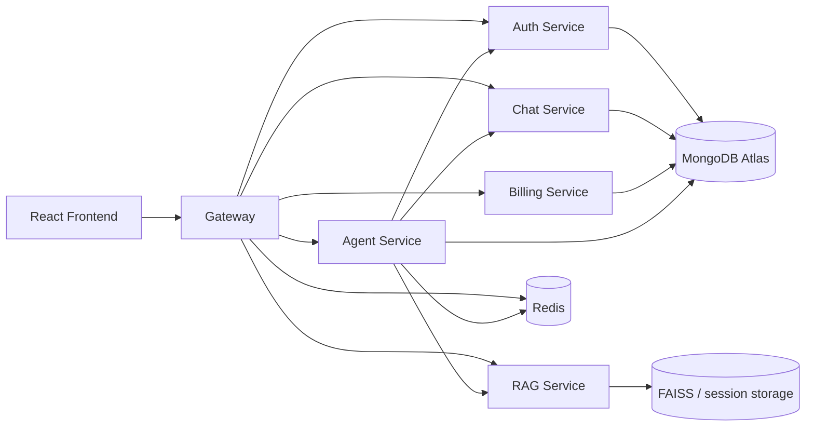

# Kifaru Architecture

## Overview

Kifaru is a multi-service AI application with a React frontend, a Node.js gateway, separate backend services for auth, chat, billing, and agent orchestration, plus a dedicated FastAPI rag service for PDF question answering.

The system is organized so the frontend talks to one public entrypoint, the gateway. The gateway authenticates the user, attaches the user context to internal requests, and forwards traffic to the correct backend service. PDF chat is handled separately by the rag service, which keeps the document ingestion and retrieval pipeline isolated from the general agent stack.

## Main Goals

- Keep user-facing chat, coding, image, search, and PDF workflows separated by service.
- Centralize auth and session checks in the gateway.
- Move PDF RAG into a dedicated service so it can evolve independently.
- Keep the frontend simple: it sends chat traffic to the gateway and PDF traffic to the rag flow.

## High-Level Flow

## Frontend

The frontend is a Vite + React app. It renders the chat shell, conversation sidebar, message list, message composer, and model/agent controls. The frontend does not directly talk to most backend services. Instead, it uses the gateway as the public backend entrypoint.

Key frontend responsibilities:

- Start or switch conversations.
- Render chat messages and assistant artifacts.
- Send normal chat, coding, search, image, and PPT requests through the gateway.
- Send PDF uploads and PDF questions through the rag flow.
- Keep the selected conversation in Redux so the UI and backend stay aligned.

## Gateway

The gateway is the public Node.js API entrypoint. It handles CORS, cookies, auth protection, and request forwarding.

What it does:

- Verifies the session cookie through Redis-backed auth state.
- Adds `x-user-id` and related headers when forwarding to protected services.
- Proxies chat, agent, billing, and rag traffic to the correct service.
- Exposes a lightweight `/api/me` endpoint for the current user.

## Auth Service

The auth service handles login, logout, and internal account operations such as credit deduction and plan updates.

It is the service that owns user identity and plan state.

## Chat Service

The chat service owns conversation storage and message history.

It is responsible for:

- Creating conversations.
- Renaming conversations.
- Deleting conversations.
- Returning conversation lists.
- Saving and loading chat messages.
- Managing folders and pinned conversations.

## Billing Service

The billing service owns payment and plan upgrade flows.

It creates payment orders and verifies completed payments, then updates the user plan through the auth service.

## Agent Service

The agent service is the orchestration layer for general AI workflows.

It handles:

- Chat responses.
- Coding requests.
- Search requests.
- Image generation.
- Vision requests.
- PPT generation.
- Agent routing when the user selects auto mode.

It no longer owns PDF RAG. PDF RAG was split into the rag microservice so document upload and question answering are isolated from the rest of the agent graph.

## RAG Service

The rag service is a dedicated FastAPI application for PDF ingestion and retrieval.

It handles:

- PDF upload and parsing.
- Session-scoped document storage.
- PDF status checks.
- Question answering over uploaded PDFs.
- Streaming PDF answers through SSE.

The rag flow is intentionally independent from the general agent service. This keeps PDF retrieval stable and easier to maintain.

## Data and Storage

### MongoDB Atlas

MongoDB Atlas is used for app data that needs persistence across services:

- Auth users and account state.
- Chat conversations and messages.
- Billing-related records.
- Agent-side conversation metadata.

### Redis

Redis is used for session and transient state:

- Login session lookup in the gateway.
- Agent conversation cache and memory helpers.
- Any short-lived orchestration state.

### RAG Storage

The rag service stores document retrieval state in its own local session storage and FAISS indexes. Each PDF upload is tied to a chat session so the same user conversation can keep querying the same uploaded document set.

## Request Flow by Feature

### Normal Chat

1. User sends a prompt from the frontend.
2. Frontend posts to the gateway.
3. Gateway authenticates the request and forwards it to the agent service.
4. Agent routes the request to the correct AI behavior.
5. Response flows back through the gateway to the frontend.

### PDF Chat

1. User selects PDF mode in the frontend.
2. Frontend uploads the PDF to the rag service through the gateway.
3. The rag service parses the PDF, chunks the text, and builds the retrieval index.
4. The user asks follow-up questions.
5. The rag service retrieves the relevant passages and streams the answer back.

### Conversation Storage

1. Agent or chat requests create/update the conversation.
2. Chat service stores messages and folder metadata.
3. Frontend reloads messages when the selected conversation changes.

### Billing Flow

1. User creates a billing order.
2. Payment is verified.
3. Billing service updates account state through auth.

## Runtime Notes

- The frontend should use the gateway as the single public API base.
- The agent service talks to chat and auth internally.
- The rag service should remain separate from the agent graph.
- MongoDB Atlas is the persistence layer, so no local Mongo container is needed in the compose file.
- Redis is still required for session state.

## Environment Layout

- `frontend`: Vite React client.
- `backend/gateway`: public API proxy.
- `backend/services/auth`: auth and session user service.
- `backend/services/chat`: conversation and message service.
- `backend/services/billing`: payment and plan service.
- `backend/services/agent`: orchestration and multi-agent logic.
- `backend/services/rag`: PDF rag microservice.

## API Endpoints

### Gateway

- `GET /` - gateway health check.
- `GET /api/me` - current authenticated user.
- `POST /api/auth/login` - login.
- `GET /api/auth/logout` - logout.
- `PATCH /api/auth/internal/update-plan` - internal plan update.
- `PATCH /api/auth/internal/deduct-credits` - internal credit deduction.
- `POST /api/chat/create-conversation` - create conversation.
- `GET /api/chat/get-conversations` - list conversations.
- `POST /api/chat/update-conversation` - rename conversation.
- `POST /api/chat/save-message` - save a chat message.
- `GET /api/chat/get-messages/:id` - load messages for a conversation.
- `DELETE /api/chat/conversations/:conversationId` - delete conversation.
- `GET /api/chat/folders` - list folders.
- `GET /api/chat/folders-with-conversations` - list folders with conversations.
- `POST /api/chat/folders` - create folder.
- `PUT /api/chat/folders/:id` - update folder.
- `DELETE /api/chat/folders/:id` - delete folder.
- `POST /api/chat/conversations/move` - move conversation to a folder.
- `PATCH /api/chat/conversations/:conversationId/pin` - pin or unpin conversation.
- `POST /api/agent/chat` - agent request and streaming chat flow.
- `POST /api/billing/create-order` - create billing order.
- `POST /api/billing/verify-payment` - verify billing payment.
- `POST /api/rag/upload` - upload a PDF to the rag service.
- `GET /api/rag/status` - check whether a PDF is loaded.
- `POST /api/rag/ask` - ask a PDF question.
- `POST /api/rag/ask/stream` - ask a PDF question with SSE streaming.
- `GET /api/rag/health` - rag health check.
- `GET /api/rag/models` - rag model list.
- `GET /api/rag/pipeline-info` - rag pipeline description.
- `GET /api/rag/runtime-summary` - rag runtime summary.
- `POST /api/oversight` - Sentry tunnel endpoint.

### Direct Service Endpoints

- `POST /chat` on the agent service - internal agent entrypoint before gateway proxying.
- `POST /upload` on the rag service - direct PDF upload endpoint.
- `GET /status` on the rag service - direct rag status endpoint.
- `POST /ask` on the rag service - direct PDF question endpoint.
- `POST /ask/stream` on the rag service - direct streaming PDF question endpoint.
- `GET /health` on the rag service - health endpoint.
- `GET /models` on the rag service - available model list.
- `GET /pipeline-info` on the rag service - pipeline description.
- `GET /runtime-summary` on the rag service - runtime summary.
- `GET /` on the rag service - root health response.
