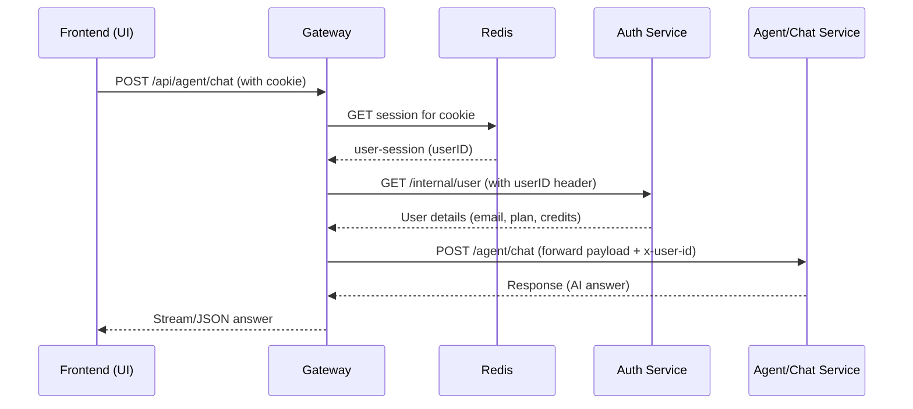

# Kifaru AI – System Overview

**Executive Summary:** Kifaru is a modular AI platform integrating chat, coding, search, and PDF QA.  We split functionality into dedicated microservices (Auth, Chat, Agent, Billing, and a FastAPI RAG service) behind a Node.js Gateway.  The Gateway handles authentication (via Redis-backed sessions) and proxies requests to internal services.  For AI orchestration we use [LangChain](https://docs.langchain.com) and [LangGraph](https://docs.langchain.com/oss/python/langgraph/overview) (LangGraph is a “low-level orchestration framework and runtime for building, managing, and deploying long-running, stateful agents”).  Our RAG (Retrieval-Augmented Generation) flow uses PDF ingestion, vector search (FAISS), and LLM answer generation (enhancing accuracy by retrieving external knowledge).  We emphasize clear boundaries, secure design, and full observability.

## Goals

- **Modular Workflows:** Separate user-facing chat/coding/image from PDF QA (RAG) into distinct services.  
- **Single Entry & Auth:** All frontend calls go through the Gateway, which validates HTTP-only auth cookies and attaches user identity.  
- **Scalability & Fault Tolerance:** Use stateless services, containerization (Docker/Kubernetes), and durable state (MongoDB, Redis, FAISS) so components can scale or restart independently.  
- **Clean Separation:** Frontend Redux state drives behavior; gateway ensures each request is authorized and routed correctly. RAG is isolated so PDF ingestion and querying have dedicated compute/storage without affecting the general agent graph.

## Technology Stack

- **Frontend:** Vite + React (TypeScript) for chat UI, file upload, streaming responses, etc.  
- **Gateway:** Node.js (Express) proxy with session cookie auth via Redis. Attaches `x-user-id` and proxies API calls internally.  
- **Authentication:** Auth Service (Node.js, Express) with Firebase for credentials, MongoDB for user accounts/plans. Issues secure cookies; Redis session store for fast lookup.  
- **Chat/Conversations:** Chat Service (Node.js/Express) with MongoDB. Stores conversations, messages, folders, and pins.  
- **AI Orchestration:** Agent Service (Python/FastAPI) uses LangChain and LangGraph to run chat, code, search, image, and auto-agents. LangGraph provides **persistent state and streaming** for complex flows. Short-term (thread-scoped) memory is stored in LangGraph state.  
- **Billing:** Billing Service (Node.js) handles order creation and payment verification, updates user plan via Auth.  
- **RAG Pipeline:** RAG Service (Python/FastAPI) ingests PDFs, chunks text, creates FAISS vector indexes, and answers PDF questions via retrieval+LLM. (We stream answers using SSE or WebSockets for good UX.)  
- **Databases:** MongoDB Atlas (users, conversations, messages, billing records), Redis (session tokens, agent thread context), plus local FAISS indexes per RAG session.  
- **AI Models:** Supports multiple LLM/embedding providers via LangChain and OpenRouter. E.g. OpenAI, Google Gemini, Groq, Qwen, etc. We define a fallback chain of embeddings (OpenAI → Gemini → Groq, etc) to improve reliability.  

## Architecture Diagram

```mermaid
flowchart LR
    UI[React Frontend] -->|HTTPS| GW[Gateway API]
    GW --> AUTH[Auth Service]
    GW --> CHAT[Chat Service]
    GW --> AGENT[Agent Service]
    GW --> BILLING[Billing Service]
    GW --> RAG[RAG Service (PDF QA)]
    AGENT --> CHAT
    AGENT --> AUTH
    AGENT --> RAG
    AUTH -->|Mongo| MONGO[(MongoDB)]
    CHAT -->|Mongo| MONGO
    BILLING -->|Mongo| MONGO
    AGENT -->|Mongo| MONGO
    GW -->|Redis| REDIS[(Redis)]
    AGENT -->|Redis| REDIS
    RAG -->|Local FS/FAISS| STORAGE[(FAISS / Session Store)]
```

This high-level view shows user traffic (←) going through the Gateway, which enforces auth (via Redis) and routes calls to backend services.  The Chat, Auth, Billing, and Agent services all read/write MongoDB.  The RAG service uses local file storage and FAISS for vector indexes (tied to the user’s session).

## Gateway

The Gateway is a Node.js Express API that:

- **Secures & Attaches User Context:** Verifies the session cookie (via Redis). On success, it adds `x-user-id` (and role/plan info) to downstream requests.  
- **Routes Requests:** Proxies chat, agent, billing, and RAG calls to the appropriate internal service.  
- **CORS & Cookies:** Enforces CORS policy for the frontend origin and uses HTTP-only, secure cookies for auth tokens.  
- **Session Endpoint:** Exposes a lightweight `/api/me` to confirm login (returns current user profile from Auth Service).  

**Sequence (e.g., on a chat request):**



*(Note: all `/internal/*` endpoints between services use `x-user-id` and secure headers internally.)*

## Authentication Service

The Auth Service (Node.js) handles signup, login, logout, and account management:

- **Login:** Verifies credentials (via Firebase Auth), then creates a Redis session and issues a secure cookie.  
- **Logout:** Deletes Redis session, clears cookie.  
- **Account State:** Stores user profile, plan, and credit balance in MongoDB.  
- **Plan/Credit Updates:** Internal PATCH endpoints (`/internal/update-plan`, `/internal/deduct-credits`) allow other services (e.g. Billing or Agent) to adjust the user’s plan or subtract usage. These endpoints require `x-user-id`.  

**Key security:** Cookies are HTTP-only & same-site. Sensitive operations check Redis session and require an active plan.  

## Chat Service

The Chat Service (Node.js) manages user conversations and messages:

- **Conversations API:** Create, list, rename, delete conversations. Supports folders and pin/unpin.  
- **Messages API:** Save and retrieve messages for a conversation. Each message includes `{ role: user/assistant, content, timestamp, metadata }`.  
- **Storage:** Persists all data in MongoDB (e.g., a `conversations` collection and a `messages` collection). Indexes on userID and conversationID for performance.  
- **Folder Management:** Endpoints to manage folder metadata for organization.  

*Example:* When the Agent Service generates an assistant response, it POSTs that message to `/api/chat/save-message` so the Chat Service can store it in the current conversation.  

## API Endpoints

We expose a comprehensive set of HTTP endpoints. Key ones include:

- **Gateway (Public API):**  
  - `GET /` – Health check (returns “OK”).  
  - `GET /api/me` – Return current authenticated user profile.  
- **Auth:**  
  - `POST /api/auth/login` – Sign in.  
  - `GET /api/auth/logout` – Sign out.  
  - `PATCH /api/auth/internal/update-plan` – (Internal) Change user plan.  
  - `PATCH /api/auth/internal/deduct-credits` – (Internal) Deduct user credits.  
- **Chat (via Gateway):**  
  - `POST /api/chat/create-conversation` – New conversation.  
  - `GET /api/chat/get-conversations` – List user’s conversations.  
  - `POST /api/chat/update-conversation` – Rename or update conversation.  
  - `DELETE /api/chat/conversations/:id` – Delete a conversation.  
  - `POST /api/chat/save-message` – Save a chat message.  
  - `GET /api/chat/get-messages/:id` – Load messages for a conversation.  
  - `GET /api/chat/folders` – List folders.  
  - `GET /api/chat/folders-with-conversations` – List folders with conversation trees.  
  - `POST /api/chat/folders` – Create folder.  
  - `PUT /api/chat/folders/:id` – Rename folder.  
  - `DELETE /api/chat/folders/:id` – Delete folder.  
  - `POST /api/chat/conversations/move` – Move conversation to a folder.  
  - `PATCH /api/chat/conversations/:conversationId/pin` – Pin/unpin conversation.  
- **Agent (Chat/Coding/Image) (via Gateway):**  
  - `POST /api/agent/chat` – Start a chat query (streams assistant tokens).  
  - (Other agent tasks like code or search use different routes under `/api/agent` similarly.)  
- **Billing:**  
  - `POST /api/billing/create-order` – Generate payment order.  
  - `POST /api/billing/verify-payment` – Confirm a payment and update plan.  
- **RAG (PDF QA) (via Gateway):**  
  - `POST /api/rag/upload` – Upload a PDF document to ingest.  
  - `GET  /api/rag/status` – Check if PDF processing is complete for this session.  
  - `POST /api/rag/ask` – Ask a question about the uploaded PDF.  
  - `POST /api/rag/ask/stream` – Ask a question with SSE streaming of the answer.  
  - `GET /api/rag/health` – RAG service health.  
  - `GET /api/rag/models` – List available embedding/LLM models.  
  - `GET /api/rag/pipeline-info` – Info on how RAG pipeline works.  
  - `GET /api/rag/runtime-summary` – Stats (e.g. number of pages indexed, memory usage).  
- **Oversight:** (for Sentry)  
  - `POST /api/oversight` – Proxy for sending logs/exceptions to Sentry.  

**Direct Service Endpoints:**  (used internally or for testing; Gateway proxies these)  
- **Agent Service:** `POST /chat` – Internal chat entrypoint.  
- **RAG Service:**  
  - `POST /upload` (PDF upload)  
  - `GET /status`  
  - `POST /ask` (question)  
  - `POST /ask/stream`  
  - `GET /health`, `/models`, `/pipeline-info`, `/runtime-summary` (same as above without `/api/rag` prefix).  

Each endpoint expects `x-user-id` header (inserted by Gateway) and JSON bodies. All APIs validate the user’s plan and subtract credits as needed (e.g. using internal credit-deduct API).

```

